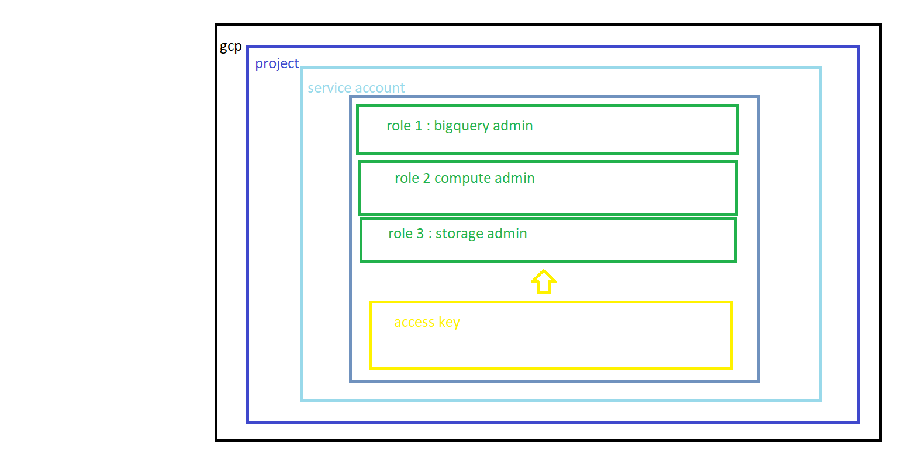
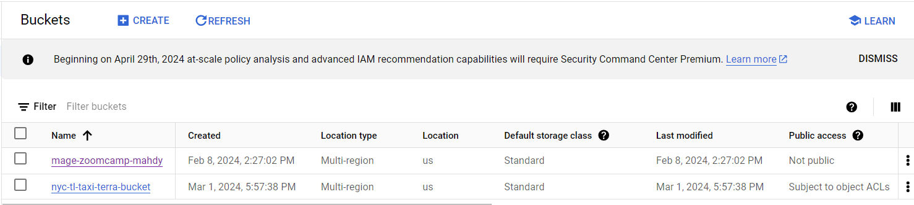
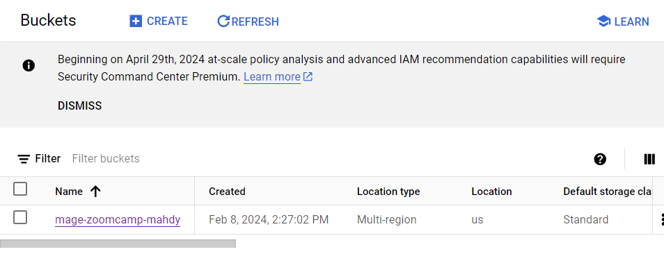

# 1. Terraform basics

Terraform is an open-source infrastructure as code (IaC) software tool created by HashiCorp. It allows developers to define and provide data center infrastructure using a declarative configuration language. This means you describe your desired state of infrastructure, and Terraform will figure out how to achieve that state. With Terraform, you can manage a wide variety of service providers as well as custom in-house solutions.

The `main.tf` file is the default filename for the main Terraform configuration in a directory. It is written in the HashiCorp Configuration Language (HCL). The `main.tf` file typically contains resource blocks that describe what resources to create. For example, it might specify that you want to create a certain number of virtual machines in a cloud provider, or set up a database in a database service.

**setting up the workflow**

1. create the service account in the project we’re workin on on google cloud account 
2. creating the roles require for the service account, creating the key 
    
    
    
3. create a working directory on vs code for terraform>a keys directory> nano my-creds.json>paste the generated key of the service account “ don’t forget to put keys directory in the .gitignore file”
4. Create the main.tf file “ cd .. first to get back out from the keys directory”:
This Terraform configuration sets up the Google Cloud provider.
    
    ```
    terraform {
      required_providers {
        google = {
          source  = "hashicorp/google"
          version = "5.18.0"
        }
      }
    }
    
    provider "google" {
      project = "my-project-id"
      region  = "us-central1"
    }
    
    ```
    
    - The `required_providers` block within the `terraform` block is used to specify the providers required for your project. In this case, it specifies that the Google provider is required, and it should be sourced from "hashicorp/google" with version "5.18.0".
        - The `provider "google"` block is used to configure the Google provider. The `project` argument is set to the ID of your Google Cloud project, and the `region` argument is set to the default region to use for your resources, in this case, "us-central1".
        - The `terraform fmt` command is used to rewrite Terraform configuration files to a canonical format and style. This command applies a subset of the Terraform language style conventions, along with other minor adjustments for readability.
5. teaching terraform to use GOOGLE_CREADENTIALS:
    
    ```bash
    $export GOOGLE_CREDENTIALS='/workspaces/DEZoomcamp24Rethink/01-docker-terraform/02-terraform/keys/my-creds.json'
    @MahmoudMahdy448 ➜ /workspaces/DEZoomcamp24Rethink/01-docker-terraform/02-terraform (main) $ echo GOOGLE_CREDENTIALS
    echo GO$GOOGLE_CREDENTIALS
    GO/workspaces/DEZoomcamp24Rethink/01-docker-terraform/02-terraform/keys/my-creds.json
    ```
    
    The command is a shell command that sets an environment variable `GOOGLE_CREDENTIALS` to the path of your Google Cloud credentials file. This environment variable can then be used in your applications or scripts to authenticate with Google Cloud services.
    
    In the context of Terraform, you can use this environment variable(hardcoded) in your provider configuration:
    
    ```
    provider "google" {
      credentials = file(env("GOOGLE_CREDENTIALS"))
      project     = "my-project-id"
      region      = "us-central1"
    }
    
    ```
    
    In this example, `env("GOOGLE_CREDENTIALS")` retrieves the value of the `GOOGLE_CREDENTIALS` environment variable, and `file(...)` reads the file at that path. The contents of the file are used as the credentials to authenticate with Google Cloud.
    
6. The `terraform init` command is used to initialize a working directory containing Terraform configuration files. This is the first command that should be run after writing a new Terraform configuration or cloning an existing one from version control. It is safe to run this command multiple times.
    
    Here's what `terraform init` does:
    
    - It downloads the required provider plugins into a subdirectory under the `.terraform` directory in your working directory. The providers to download are determined by the `required_providers` block within the `terraform` block in your configuration, *so in our case it’s like the peace of code Terraform uses to talk to GCP.*
    - It sets up the backend for storing your Terraform state. By default, Terraform uses a local backend which stores state on your local filesystem. You can configure a different backend like a remote backend to store state in a remote, shared store.
    
    Here's how you can use `terraform init`:
    
    1. Navigate to the directory containing your Terraform configuration files in the terminal.
        
        ```bash
        cd /path/to/your/terraform/files
        
        ```
        
    2. Run the `terraform init` command.
        
        ```bash
        $ terraform init
        
        Initializing the backend...
        
        Initializing provider plugins...
        - Finding hashicorp/google versions matching "5.18.0"...
        - Installing hashicorp/google v5.18.0...
        - Installed hashicorp/google v5.18.0 (signed by HashiCorp)
        
        Terraform has created a lock file .terraform.lock.hcl to record the provider
        selections it made above. Include this file in your version control repository
        so that Terraform can guarantee to make the same selections by default when
        you run "terraform init" in the future.
        
        Terraform has been successfully initialized!
        
        You may now begin working with Terraform. Try running "terraform plan" to see
        any changes that are required for your infrastructure. All Terraform commands
        should now work.
        
        If you ever set or change modules or backend configuration for Terraform,
        rerun this command to reinitialize your working directory. If you forget, other
        commands will detect it and remind you to do so if necessary.
        
        ```
        
        This will initialize your Terraform working directory. If the initialization is successful, you'll see a message saying "Terraform has been successfully initialized!"
        
    
7. so now we will create a ***Terraform resource***, which is a GCS Bucket:
    
    ```
    resource "google_storage_bucket" "auto-expire" {
      name          = "nyc-tl-taxi-terra-bucket"
      location      = "US"
      force_destroy = true
    
      lifecycle_rule {
        condition {
          age = 1
        }
        action {
          type = "AbortIncompleteMultipartUpload"
        }
      }
    }
    ```
    
    This Terraform code creates a Google Cloud Storage bucket named "nyc-tl-taxi-terra-bucket" in the US. It's configured to abort incomplete uploads after 1 day. The bucket can be deleted even if it's not empty due to `force_destroy = true`.
    
8. after adding this resource to the main.tf file we’re going to run $ terraform plan:
    
    ```bash
    $ terraform plan
    
    Terraform used the selected providers to generate the following execution plan. Resource actions are indicated with the following
    symbols:
      + create
    
    Terraform will perform the following actions:
    
      # google_storage_bucket.auto-expire will be created
      + resource "google_storage_bucket" "auto-expire" {
          + effective_labels            = (known after apply)
          + force_destroy               = true
          + id                          = (known after apply)
          + location                    = "US"
          + name                        = "nyc-tl-taxi-terra-bucket"
          + project                     = (known after apply)
          + public_access_prevention    = (known after apply)
          + rpo                         = (known after apply)
          + self_link                   = (known after apply)
          + storage_class               = "STANDARD"
          + terraform_labels            = (known after apply)
          + uniform_bucket_level_access = (known after apply)
          + url                         = (known after apply)
    
          + lifecycle_rule {
              + action {
                  + type = "AbortIncompleteMultipartUpload"
                }
              + condition {
                  + age                   = 1
                  + matches_prefix        = []
                  + matches_storage_class = []
                  + matches_suffix        = []
                  + with_state            = (known after apply)
                }
            }
        }
    
    Plan: 1 to add, 0 to change, 0 to destroy.
    
    ────────────────────────────────────────────────────────────────────────────────────────────────────────────────────────────────────
    
    Note: You didn't use the -out option to save this plan, so Terraform can't guarantee to take exactly these actions if you run
    "terraform apply" now.
    
    ```
    
    The `terraform plan` command shows what actions Terraform will take to reach the desired state defined in your configuration. ***It's a way to preview changes without making them.***
    
    In your case, Terraform plans to create a Google Cloud Storage bucket named "nyc-tl-taxi-terra-bucket" in the US. The bucket will abort incomplete uploads after 1 day and can be deleted even if it's not empty.
    
    The message at the end suggests using the `-out` option with `terraform plan` to save this plan. This saved plan can then be applied with `terraform apply` to ensure Terraform executes exactly this plan.
    
9. as we knew `terraform plan` is a ***a way to preview changes without making them to make sure everything is okey!***now we need to deploy our bucket to GCS so we’ll run terraform apply :
    
    ```bash
    $ terraform apply
    
    Terraform used the selected providers to generate the following execution plan. Resource actions are indicated with the following
    symbols:
      + create
    
    Terraform will perform the following actions:
    
      # google_storage_bucket.auto-expire will be created
      + resource "google_storage_bucket" "auto-expire" {
          + effective_labels            = (known after apply)
          + force_destroy               = true
          + id                          = (known after apply)
          + location                    = "US"
          + name                        = "nyc-tl-taxi-terra-bucket"
          + project                     = (known after apply)
          + public_access_prevention    = (known after apply)
          + rpo                         = (known after apply)
          + self_link                   = (known after apply)
          + storage_class               = "STANDARD"
          + terraform_labels            = (known after apply)
          + uniform_bucket_level_access = (known after apply)
          + url                         = (known after apply)
    
          + lifecycle_rule {
              + action {
                  + type = "AbortIncompleteMultipartUpload"
                }
              + condition {
                  + age                   = 1
                  + matches_prefix        = []
                  + matches_storage_class = []
                  + matches_suffix        = []
                  + with_state            = (known after apply)
                }
            }
        }
    
    Plan: 1 to add, 0 to change, 0 to destroy.
    
    Do you want to perform these actions?
      Terraform will perform the actions described above.
      Only 'yes' will be accepted to approve.
    
      Enter a value: yes
    
    google_storage_bucket.auto-expire: Creating...
    google_storage_bucket.auto-expire: Creation complete after 2s [id=nyc-tl-taxi-terra-bucket]
    
    Apply complete! Resources: 1 added, 0 changed, 0 destroyed.
    
    ```
    
    now if we head to our GCP account and navigate to our buckets, we should find our **nyc-tl-taxi-terra-bucket:**
    
    
    
    also we will notice that a file named `terraform.tfstate` is create in our working directory after the `terraform apply` command runs.
    
10. Now we will get to know the terraform destroy command:
    
    ```bash
    $ terraform destroy
    google_storage_bucket.auto-expire: Refreshing state... [id=nyc-tl-taxi-terra-bucket]
    
    Terraform used the selected providers to generate the following execution plan. Resource actions are indicated with the following
    symbols:
      - destroy
    
    Terraform will perform the following actions:
    
      # google_storage_bucket.auto-expire will be destroyed
      - resource "google_storage_bucket" "auto-expire" {
          - default_event_based_hold    = false -> null
          - effective_labels            = {} -> null
          - enable_object_retention     = false -> null
          - force_destroy               = true -> null
          - id                          = "nyc-tl-taxi-terra-bucket" -> null
          - labels                      = {} -> null
          - location                    = "US" -> null
          - name                        = "nyc-tl-taxi-terra-bucket" -> null
          - project                     = "nyc-tl-taxi" -> null
          - public_access_prevention    = "inherited" -> null
          - requester_pays              = false -> null
          - rpo                         = "DEFAULT" -> null
          - self_link                   = "https://www.googleapis.com/storage/v1/b/nyc-tl-taxi-terra-bucket" -> null
          - storage_class               = "STANDARD" -> null
          - terraform_labels            = {} -> null
          - uniform_bucket_level_access = false -> null
          - url                         = "gs://nyc-tl-taxi-terra-bucket" -> null
    
          - lifecycle_rule {
              - action {
                  - type = "AbortIncompleteMultipartUpload" -> null
                }
              - condition {
                  - age                        = 1 -> null
                  - days_since_custom_time     = 0 -> null
                  - days_since_noncurrent_time = 0 -> null
                  - matches_prefix             = [] -> null
                  - matches_storage_class      = [] -> null
                  - matches_suffix             = [] -> null
                  - no_age                     = false -> null
                  - num_newer_versions         = 0 -> null
                  - with_state                 = "ANY" -> null
                }
            }
        }
    
    Plan: 0 to add, 0 to change, 1 to destroy.
    
    Do you really want to destroy all resources?
      Terraform will destroy all your managed infrastructure, as shown above.
      There is no undo. Only 'yes' will be accepted to confirm.
    
      Enter a value: yes
    
    google_storage_bucket.auto-expire: Destroying... [id=nyc-tl-taxi-terra-bucket]
    google_storage_bucket.auto-expire: Destruction complete after 1s
    
    Destroy complete! Resources: 1 destroyed.
    
    ```
    
    The `terraform destroy` command is used to remove all resources that exist in the current Terraform state. It's useful in the following scenarios, the `terraform.tfstate` file will be reset as well:
    
    1. **Cleanup**: If you're done using the resources or if they were only needed temporarily, you can use `terraform destroy` to clean up and avoid incurring further costs.
    2. **Rebuilding from Scratch**: If you want to rebuild your infrastructure from scratch, `terraform destroy` can be used to remove all existing resources before you run `terraform apply` again.
    3. **Testing**: `terraform destroy` is useful in testing to ensure your Terraform scripts are creating and destroying resources correctly.
    
    Remember, `terraform destroy` will remove all resources in the Terraform state, so it should be used carefully to avoid accidentally deleting important resources.
    
    this means if we head to our GCP account and navigate to our buckets, we should find our **nyc-tl-taxi-terra-bucket DESTROYED/DELETED  :**



    

**Summary**

Terraform commands that we’ve used so far:

1. `terraform fmt`: Rewrites Terraform configuration files to a canonical format and style. It's used to ensure consistent formatting in your code.
2. `terraform init`: Initializes your Terraform working directory by downloading the necessary provider plugins and setting up the backend for storing state.
3. `terraform plan`: Shows what actions Terraform will take to reach the desired state without actually making any changes. It's a way to preview changes.
4. `terraform apply`: Applies the changes required to reach the desired state of the configuration. In your case, it was used to create a Google Cloud Storage bucket.
5. `terraform destroy`: Removes all resources that exist in the current Terraform state. It's useful for cleanup, rebuilding infrastructure from scratch, and testing.

These commands are part of the basic workflow of using Terraform to manage infrastructure.


# 2. Terraform variables

1. The `variables.tf` file in Terraform is typically used to declare variables that will be used across your Terraform configuration files.
    
    Variables in Terraform allow you to define values that can be reused in your configuration and provide a way to customize your configuration through parameters.
    
    Here's our `variables.tf` file:
    
    ```hcl
    variable "project" {
      description = "project"
      default     = "nyc-tl-taxi"
    
    }
    
    variable "region" {
      description = "Project region name"
      default     = "us-central1"
    
    }
    
    variable "location" {
      description = "Project location name"
      default     = "US"
    
    }
    
    variable "bq_dataset_name" {
      description = "my bigquery dataset name"
      default     = "demo_bq_dataset"
    }
    
    variable "gcs_bucket_name" {
      description = "my storage bucket name"
      default     = "nyc-tl-taxi-terra-bucket"
    }
    
    variable "gcs_storage_class" {
      description = "bucket storage class"
      default     = "STANDARD"
    }
    ```
    
    This Terraform code declares several variables with default values:
    
    - `project`: The project name, default is "nyc-tl-taxi".
    - `region`: The project region name, default is "us-central1".
    - `location`: The project location name, default is "US".
    - `bq_dataset_name`: The BigQuery dataset name, default is "demo_bq_dataset".
    - `gcs_bucket_name`: The Google Cloud Storage bucket name, default is "nyc-tl-taxi-terra-bucket".
    - `gcs_storage_class`: The storage class for the bucket, default is "STANDARD".
    
    These variables can be used in other Terraform configuration files in the same directory. If no value is provided when running `terraform apply`, the default value will be used.


    2. then the `main.tf` file should look like this: notice we are mapping from the `variables.tf`
 file using the var. in each variable.
    
   ```hcl
    # main.tf
    terraform {
      required_providers {
        google = {
          source  = "hashicorp/google"
          version = "5.18.0"
        }
      }
    }
    
    provider "google" {
      credentials = file(var.credentials_file_path)
      project = var.project
      region  = var.region
    }
    
    resource "google_storage_bucket" "auto-expire" {
      name          = var.gcs_bucket_name
      location      = var.location
      force_destroy = true
    
      lifecycle_rule {
        condition {
          age = 1
        }
        action {
          type = "AbortIncompleteMultipartUpload"
        }
      }
    }
    
    resource "google_bigquery_dataset" "demo_bq_dataset" {
      dataset_id = var.bq_dataset_name
      location   = var.location
    }
    ```


    3. In Terraform, functions are used to transform and combine values. The `file()` function is one of these built-in functions.
    - `file(PATH)`: The `file` function reads the contents of a file at the given path and returns them as a string. This is often used to load data files or scripts that are needed by a resource during its creation.
    - so we can now $ unset GOOGLE_CREDENTIALS to forget the the credentials file and declare it as a variable, in the `variables.tf` file then we can use this `file(PATH)` function in the `main.tf` file :
        
        ```hcl
        # variables.tf

        variable "credentials_file_path" {
            description = "value of the credentials file"
            default     = "./keys/my-creds.json"
          
        }
        
        ```
        
        ```hcl
        # main.tf

        provider "google" {
          credentials = file(var.credentials_file_path)
          project = var.project
          region  = var.region
        }
        ```