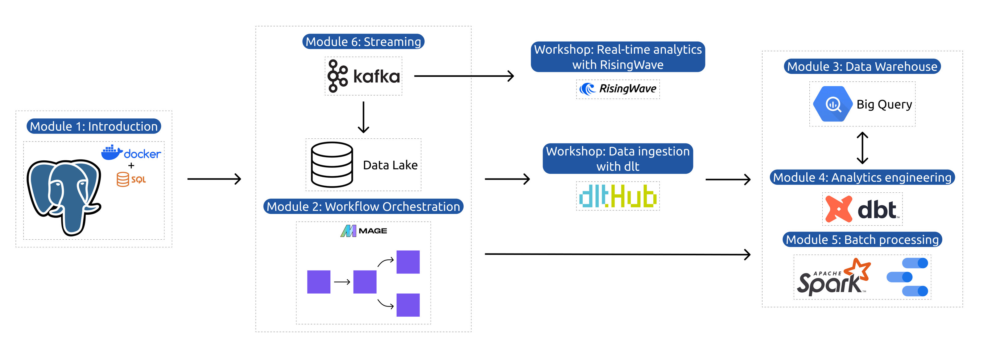

# Data Engineering Zoomcamp

This repository is for studying the course of Data Engineering Zoomcamp. It will contain notes and homework assignments for each module of the course.

## Course Modules

Module 1: Containerization and Infrastructure as Code
- Course overview
- Introduction to GCP
- Docker and docker-compose
- Running Postgres locally with Docker
- Setting up infrastructure on GCP with Terraform
- Preparing the environment for the course
- Homework

Module 2: Workflow Orchestration
- Data Lake
- Workflow orchestration
- Workflow orchestration with Mage
- Homework

Workshop 1: Data Ingestion
- Reading from APIs
- Building scalable pipelines
- Normalizing data
- Incremental loading
- Homework

Module 3: Data Warehouse
- Data Warehouse
- BigQuery
- Partitioning and clustering
- BigQuery best practices
- Internals of BigQuery
- BigQuery Machine Learning

Module 4: Analytics Engineering
- Basics of analytics engineering
- dbt (data build tool)
- BigQuery and dbt
- Postgres and dbt
- dbt models
- Testing and documenting
- Deployment to the cloud and locally
- Visualizing the data with Google Data Studio and Metabase

Module 5: Batch Processing
- Batch processing
- What is Spark
- Spark Dataframes
- Spark SQL
- Internals: GroupBy and joins

Module 6: Streaming
- Introduction to Kafka
- Schemas (avro)
- Kafka Streams
- Kafka Connect and KSQL

Workshop 2: Stream Processing with SQL

Project
- Putting everything we learned to practice
- Week 1 and 2: working on your project

## Overview

